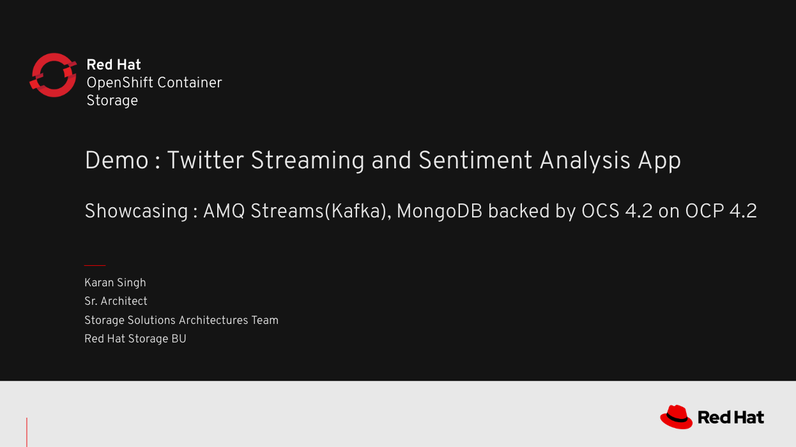
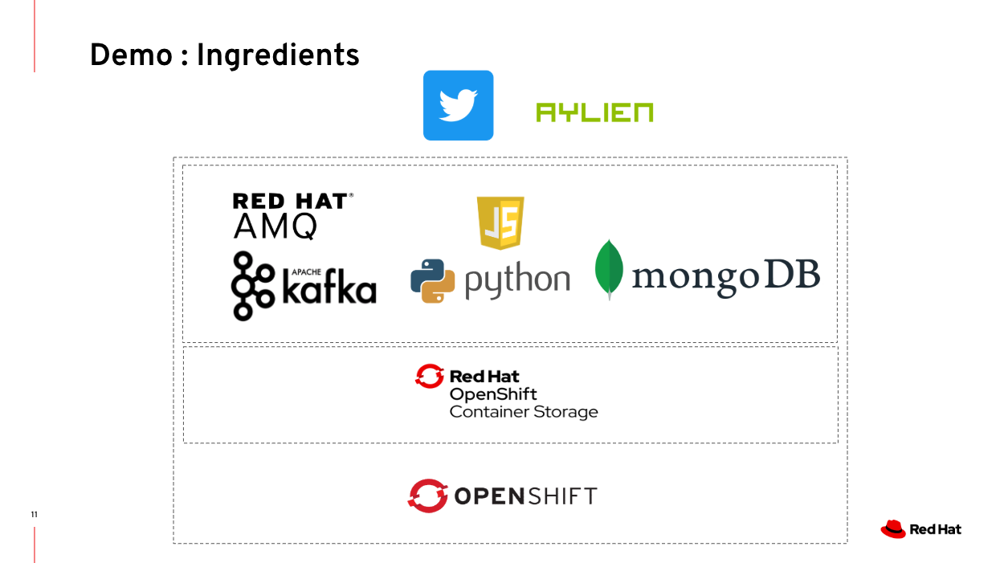
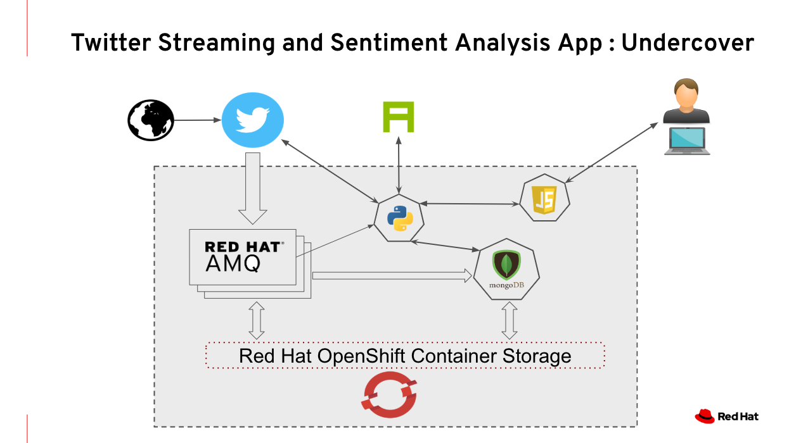
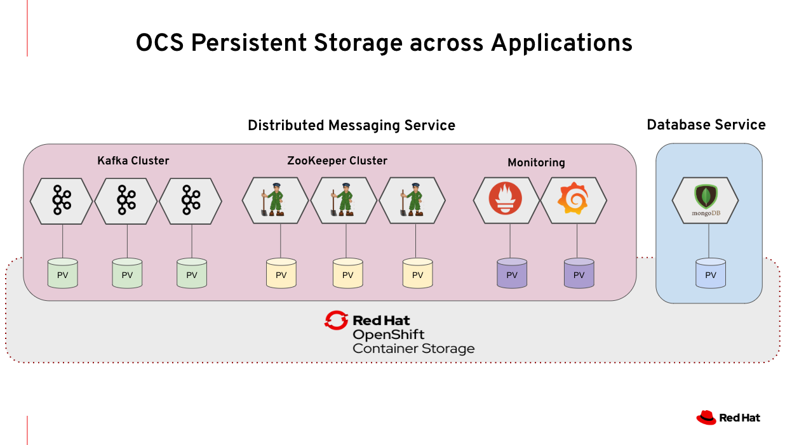
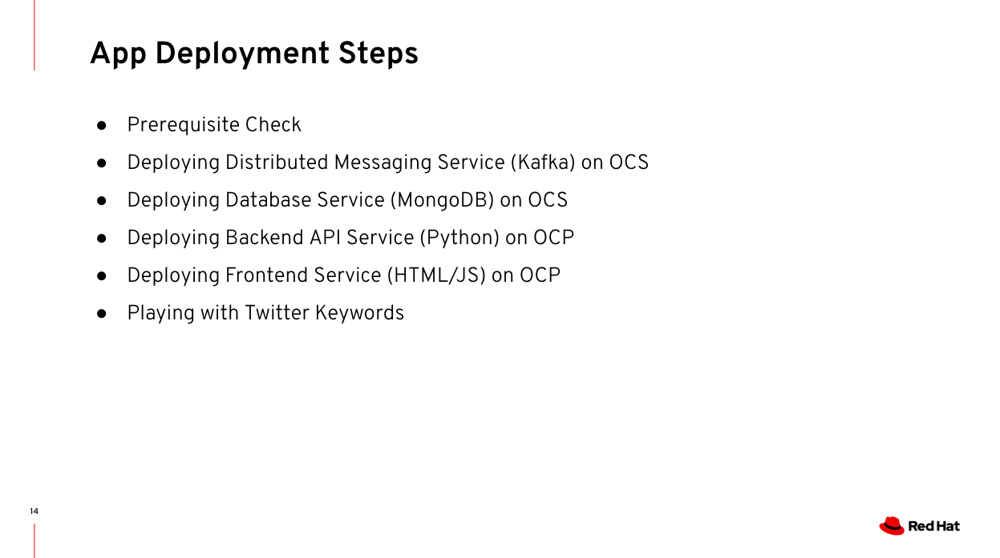
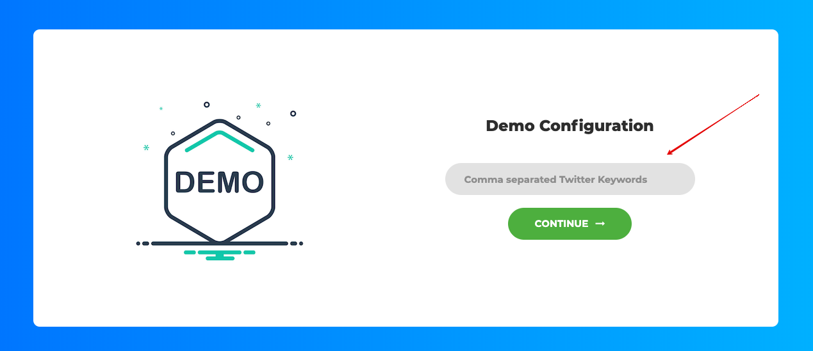
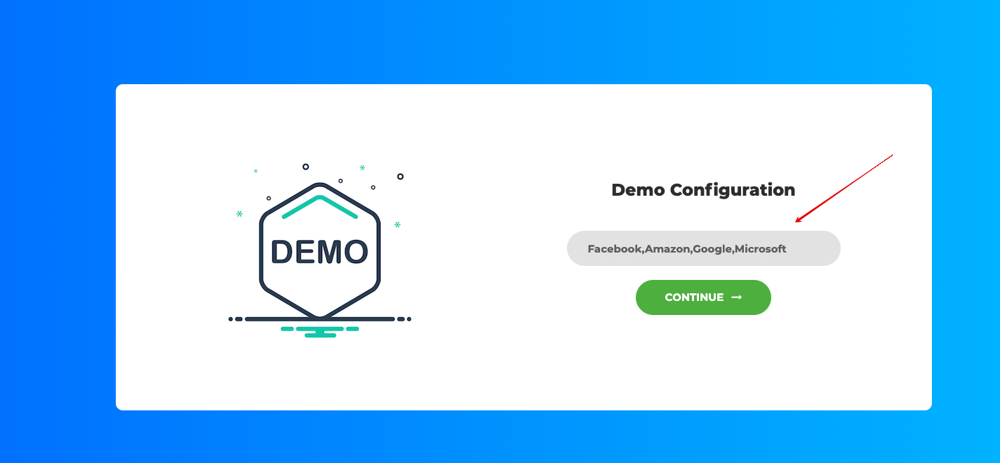
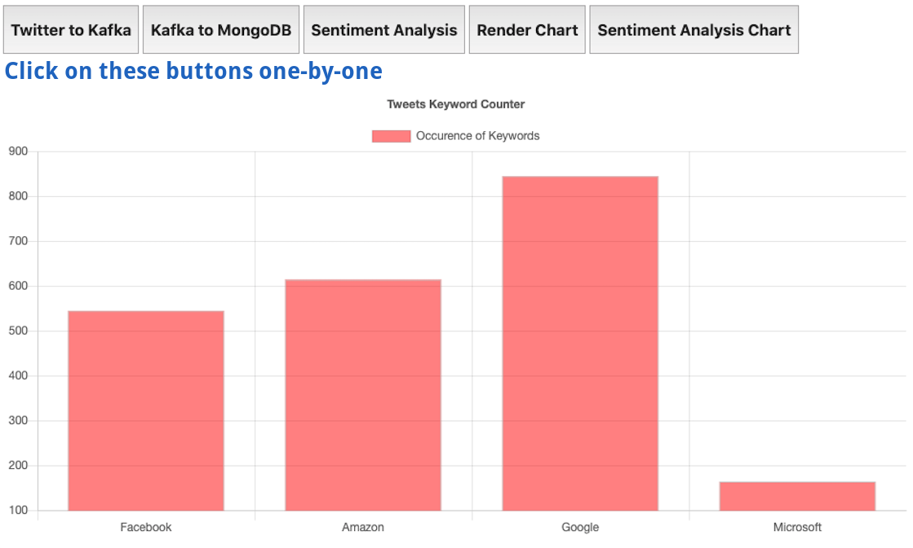
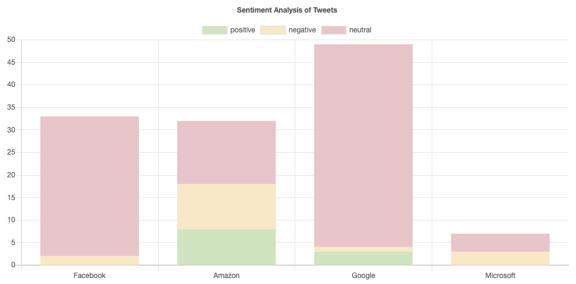

# Demo App : Running on OpenShift with persistent storage from OpenShift Container Storage

Follow this demo hands-on-exercise to deploy a ``Twitter Streaming and Sentiment Analysis App`` running on OpenShift consuming persistent storage from OpenShift Container Storage







- Once you follow the demo the output should look like this






# Instructions

## Pre-Pre-requisite

1. Register for a [developer account](https://developer.twitter.com/) on twitter and get your API keys. This will be required for this demo
2. Register for Aylien [developer account](https://developer.aylien.com/text-api-demo) and grab your API keys. This will be required for this demo 


## Pre-requisite

1. Verify OCS cluster status from dashboard
2. verify OCS cluster status from CLI

```
oc project openshift-storage
```
```
TOOLS_POD=$(oc get pods -n openshift-storage -l app=rook-ceph-tools -o name)
oc rsh -n openshift-storage $TOOLS_POD
```
```
ceph -s
ceph osd tree
```

3. change default storage class

```
oc get sc

oc patch storageclass gp2 -p '{"metadata":{"annotations":{"storageclass.kubernetes.io/is-default-class":"false"}}}'

oc patch storageclass ocs-storagecluster-ceph-rbd -p '{"metadata":{"annotations":{"storageclass.kubernetes.io/is-default-class":"true"}}}'

oc get sc
```

## Deploy Distributed Messaging Service (Kafka)

1. Create a new project

```
oc new-project amq-streams
```

2. Install AMQ Streams Operator from console

```
watch oc get all,csv
```

3. Git clone application repository

```
git clone https://github.com/ksingh7/twitter_streaming_app_on_openshift_OCS.git
cd twitter_streaming_app_on_openshift_OCS
```

4. Verify there are no PV,PVC exist on OCS

```
oc get pv,pvc
```

5. Create Kafka Cluster (before running verify the domain name)
```
oc apply -f 01-kafka-cluster.yaml
watch oc get all
```

6. Deploy Prometheus and Grafana

```
oc apply -f 02-prometheus.yaml
oc apply -f 03-grafana.yaml
watch oc get all
```

7. Verify PV,PVC provisioned by OCS

```
oc get pvc -n amq-streams

oc get pv -o json | jq -r '.items | sort_by(.spec.capacity.storage)[]| select(.spec.claimRef.namespace=="amq-streams") | [.spec.claimRef.name,.spec.capacity.storage] | @tsv'
```

8. Add prometheus as grafana's data source and Kafka/Zookeeper dashboards

```
sh 04-grafana-datasource.sh
```

9. Grab Grafana URL

```
oc get route grafana-route --no-headers | awk '{print $2}'
```

## Deploy Database Service (Mongodb)

1. Create MongoDB template
```
oc create -f 05-ocs-mongodb-persistent-template.yaml -n openshift
oc -n openshift get template mongodb-persistent-ocs
```
2. Create MongoDB app

```
oc new-app -n amq-streams --name=mongodb --template=mongodb-persistent-ocs \
    -e MONGODB_USER=demo \
    -e MONGODB_PASSWORD=demo \
    -e MONGODB_DATABASE=twitter_stream \
    -e MONGODB_ADMIN_PASSWORD=admin
```

3. Exec into MongoDB POD

```
oc rsh $(oc get  po --selector app=mongodb --no-headers | awk '{print $1}')
```

4. Connect to MongoDB and add some recods

```
mongo -u demo -p demo twitter_stream

db.redhat.insert({name:'Red Hat Enterprise Linux',product_name:'RHEL',type:'linux-x86_64',release_date:'05/08/2019',version:8})
db.redhat.find().pretty()

```

## Deploying Python Backend API Service

1. Allow container to run as root

```
oc adm policy add-scc-to-user anyuid -z default

```

2. Deploy backend API APP

```
oc new-app --name=backend --docker-image=karansingh/kafka-demo-backend-service --env IS_KAFKA_SSL='False' --env MONGODB_ENDPOINT='mongodb:27017' --env KAFKA_BOOTSTRAP_ENDPOINT='cluster-kafka-bootstrap:9092' --env 'KAFKA_TOPIC=topic1' --env AYLIEN_APP_ID='YOUR_KEY_HERE' --env AYLIEN_APP_KEY='YOUR_KEY_HERE' --env TWTR_CONSUMER_KEY='YOUR_KEY_HERE' --env TWTR_CONSUMER_SECRET='YOUR_KEY_HERE' --env TWTR_ACCESS_TOKEN='YOUR_KEY_HERE' --env TWTR_ACCESS_TOKEN_SECRET='YOUR_KEY_HERE' --env MONGODB_HOST='mongodb' --env MONGODB_PORT=27017 --env MONGODB_USER='demo' --env MONGODB_PASSWORD='demo' --env MONGODB_DB_NAME='twitter_stream' -o yaml > 06-backend.yaml
```
```
oc apply -f 06-backend.yaml ; oc expose svc/backend

```

3. In a new shell, tail logs of backend

```
oc logs -f $(oc get po --selector app=backend --no-headers | awk '{print $1}')
```


## Deploy Frontend Service

1. Grab the backend route

```
oc get route backend --no-headers | awk '{print $2}'
```

2. Edit results.html, Line-62 ``var url`` and update route

3. Build Frontend Docker image

```
cd frontend

docker build -t kafka-demo-frontend-service:latest .
docker tag kafka-demo-frontend-service:latest karansingh/kafka-demo-frontend-service:latest
docker push karansingh/kafka-demo-frontend-service

```


```
oc new-app --name=frontend --docker-image=karansingh/kafka-demo-frontend-service:latest ; oc expose svc/frontend ; oc get route frontend
```


